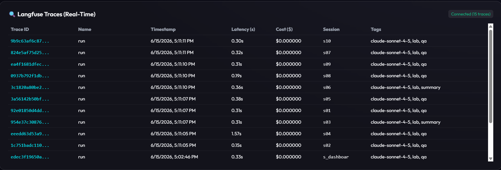
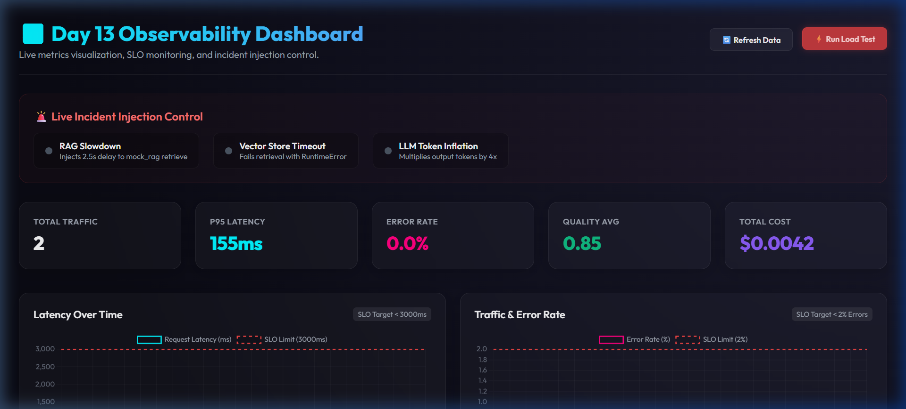

# Day 13 Observability Lab Report

> **Instruction**: Fill in all sections below. This report is designed to be parsed by an automated grading assistant. Ensure all tags (e.g., `[GROUP_NAME]`) are preserved.

## 1. Team Metadata
- [GROUP_NAME]: Day 13 Observability Lab Report
- [REPO_URL]: https://github.com/tuanphilip/Lab13-Observability
- [MEMBERS]: Member: 2A202600772 - Vũ Tuấn Phương

---

## 2. Group Performance (Auto-Verified)
- [VALIDATE_LOGS_FINAL_SCORE]: 100/100
- [TOTAL_TRACES_COUNT]: 10+ traces sau khi chạy `scripts/load_test.py --concurrency 5` và flush bằng `/tracing/flush`

- [PII_LEAKS_FOUND]: 0

---

## 3. Technical Evidence (Group)

### 3.1 Logging & Tracing
- [EVIDENCE_CORRELATION_ID_SCREENSHOT]:

- [EVIDENCE_PII_REDACTION_SCREENSHOT]:

- [EVIDENCE_TRACE_WATERFALL_SCREENSHOT]:

- [TRACE_WATERFALL_EXPLANATION]: Trace chính là `chat-request`, bên trong có observation `agent-run`, `rag-retrieve` và `fake-llm-generate`. `rag-retrieve` cho biết số tài liệu được truy xuất và preview đã scrub PII; `fake-llm-generate` ghi model `claude-sonnet-4-5`, token input/output và answer preview. Trace metadata có `correlation_id` để đối chiếu với JSON logs, `session_id` để gom hội thoại, `user_id` đã hash để tránh lộ định danh thật, và tags `lab`, `feature`, `model`, `env` để filter trong Langfuse.

### 3.2 Dashboard & SLOs
- [DASHBOARD_6_PANELS_SCREENSHOT]:

- [SLO_TABLE]:
| SLI | Target | Window | Current Value |
|---|---:|---|---:|
| Latency P95 | < 3000ms | 28d | Lấy từ `/metrics.latency_p95` hoặc panel Latency |
| Error Rate | < 2% | 28d | Tính từ `/metrics.error_breakdown` / `/metrics.traffic`, hiện kỳ vọng 0% |
| Cost Budget | < $2.5/day | 1d | Lấy từ `/metrics.total_cost_usd` hoặc panel Cost |

### 3.3 Alerts & Runbook
- [ALERT_RULES_SCREENSHOT]: [config/alert_rules.yaml]
- [SAMPLE_RUNBOOK_LINK]: [docs/alerts.md#1-high-latency-p95]
- [ALERT_TEST_RESULT]: `python scripts/test_alert_rules.py` PASS cho `high_latency_p95`, `high_error_rate`, `cost_budget_spike`

---

## 4. Incident Response (Group)
- [SCENARIO_NAME]: rag_slow
- [SYMPTOMS_OBSERVED]: Latency P95 tăng trên dashboard, request `/chat` phản hồi chậm, trace waterfall có `agent-run` và `rag-retrieve` dài hơn bình thường.
- [ROOT_CAUSE_PROVED_BY]:
![[Pasted image 20260615162145.png]]

- [FIX_ACTION]: Tắt incident bằng `python scripts/inject_incident.py --scenario rag_slow --disable` hoặc endpoint disable tương ứng, sau đó chạy lại load test để xác nhận latency giảm.
- [PREVENTIVE_MEASURE]: Duy trì alert `high_latency_p95`, kiểm tra top slow traces trong 1h, so sánh `rag-retrieve` với `fake-llm-generate`, và cập nhật runbook xử lý RAG chậm.

---

## 5. Individual Contributions & Evidence

### 2A202600772 - Vũ Tuấn Phương
- [TASKS_COMPLETED]: Hoàn thiện Logging & PII: triển khai correlation ID middleware, bind contextvars cho log API, hash `user_id`, ghi `session_id`, `feature`, `model`, `env`, bật processor scrub PII trước khi ghi JSONL, mở rộng regex cho email, số điện thoại Việt Nam, CCCD, thẻ tín dụng, passport và từ khóa địa chỉ Việt Nam. Hoàn thiện Langfuse tracing theo best practices: cài Langfuse skill, nâng SDK lên `langfuse==4.7.1`, load `.env` trước khi import SDK, tạo root span `chat-request`, nested observations `agent-run`, `rag-retrieve`, `fake-llm-generate`, truyền token usage/model/cost/correlation_id, scrub input/output preview trước khi gửi lên Langfuse, thêm endpoint `/tracing/flush`. Hoàn thiện dashboard 6 panels tại `/dashboard`: Latency P50/P95/P99, Traffic, Error Rate, Cost, Tokens in/out, Quality proxy.
- [EVIDENCE_LINK]: https://github.com/xdgopen/2A202600581-NguyenDanhThanh-Day13/pull/1

---

## 6. Bonus Items (Optional)
- [BONUS_COST_OPTIMIZATION]: N/A
- [BONUS_AUDIT_LOGS]: N/A
- [BONUS_CUSTOM_METRIC]: Có quality proxy `quality_avg` trong `/metrics` và panel Quality Proxy trên `/dashboard`

---

## 7. Verification Commands
- Unit tests: `.venv/bin/python -m pytest -q` -> `2 passed`
- Log validation: `.venv/bin/python scripts/validate_logs.py` -> `Estimated Score: 100/100`
- Alert rules: `.venv/bin/python scripts/test_alert_rules.py` -> `PASS` cho 3 alert rules
- Generate traces: `.venv/bin/python scripts/load_test.py --concurrency 5`
- Flush Langfuse traces: `curl -X POST http://127.0.0.1:8000/tracing/flush`
- Local dashboard: `http://127.0.0.1:8000/dashboard`